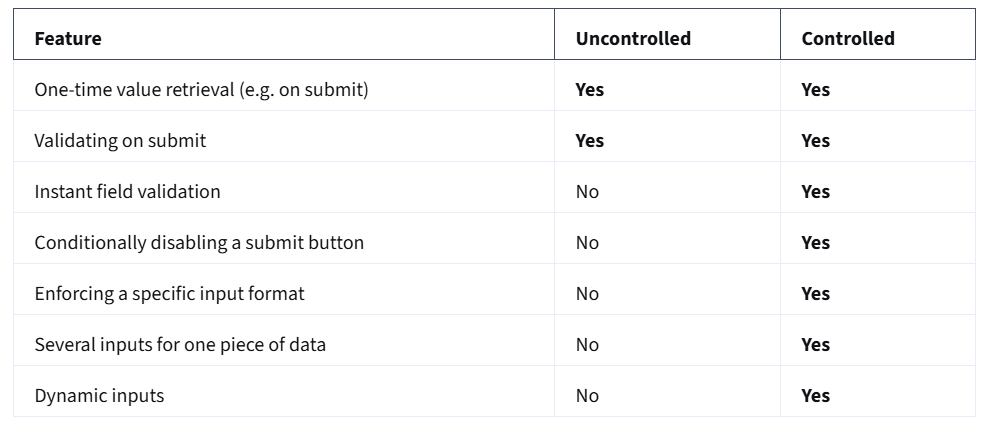

# Advance React

## Transforming Lists

A list represents an array in JavaScript, this can contain any type of data, most common element data type to encounter is an object. You may need to write more code just to retrieve information you need, which is where the map method comes in. It is a way to ignore everything you do not want displayed on the screen, and extract only the data the users care about. 

```jsx
const data =[
    {
        id: "1",
        title: "Tiramisu",
        description: "The best tiramisu in town",
        image: "https://picsum.photos/200/300/?random",
        price: "$5.00",
    },
    {
        id: "2",
        title: "Lemon Ice Cream",
        description: "Mind blowing taste",
        image: "https://picsum.photos/200/300/?random",
        price: "$4.50",
    },
    {
        id: "3",
        title: "Chocolate mousse",
        description: "Unexplored flavour",
        image: "https://picsum.photos/200/300/?random",
        price: "$6.00",
    }
];

const topDessert = data.map(dessert =>{
    return {
        content: `${dessert.title} - ${dessert.description}`,
        price: dessert.price,
    }
})
```

A new variable is defined, since the map method always returns a new array. We first apply it to the original data array. It goes element by element and transforms the data into whatever the function entered as the arguments'  return statement is. 

With react, we can transform any list of items into a collection of React components. 

```jsx
function App(){
    const listItems = topDesserts.map(dessert => {
        const itemText = `${dessert.title} - ${dessert.price}`
        return <li>{itemText}</li>
    })
    return(
        <div>
            <ul>
                {listItems}
            </ul>
        </div>
    )
}
```

here the map function returns a JSX <li> element for each object in the data array, which is then rendered under the app component's <ul> tags. 

You can also perform different operations on the same array at once.
```jsx
function DessertsList(props) {

  const lowCalorieDessert = props.data.filter(dessert => {
    return dessert.calories <= 500;
  }).sort((a, b) => {
    return a.calories - b.calories;
  }).map(dessert => {
    return (
      <li>{dessert.name} - {dessert.calories}</li>
    )
  })

  return (
    <ul>
      {lowCalorieDessert}
    </ul>
  );
}

export default DessertsList;
```
here first the input array gets filtered, then it gets sorted, then finally it gets mapped, where we get the return statement containing the element to be rendered. 

## Keys

While updating the UI of an app, React uses its Diffing Algorithm to calculate the minimum number of components that need to be changed in the tree of components. Although this algo works most of the time, there are some cases where react cannot make important assumptions to find the most optimal path for an update, which means the developer will need to step in. 

imagine the drinks section
```jsx
<ul>
    <li>Beer</li>
    <li>wine</li>
</ul>
```
When adding element to the end of this list, the Diffing algorithm works well, since react will match the two Beer trees, match the two Wine trees, and then inserts the new element.

However while adding element to beginning of the list, algo offers worse performance, bec React will mutilate every child, instead of realising that it can keep Beer and Wine subtrees intact.

To solve this issue React supports a Key attribute. Keys are identifiers that help react determine which items are changed, added or removed. Also act as instructors on how to treat a specific element when an update happens, and whether its internal state should be preserved or not. 

Adding a key to the <li> elements makes the tree efficient, this looks like:
```jsx
<ul>
    <li key='Beer'>Beer</li>
    <li key='Wine'>Wine</li>
</ul>

<ul>
    <li key="Cider">Cider</li>
    <li key='Beer'>Beer</li>
    <li key='Wine'>Wine</li>
</ul>
```

Now react knows that the element with the key cider has been added, and the elements with the keys Beer and Wine have just moved.
General rule is to use a stable identifier, that is unique within its siblings. This allows react to reuse as many elements from the list as possible, avoiding unnecessary recreations, especially when their contents is exactly the same, and the only thing that has changed is their position in the list.

The key used most often is a unique ID that comes from the data. These IDs mostly mirror database IDs, which is the ID given to an item in a database that by nature is gauranteed to be unique. What happens in cases where data doesn't have any suitable ID or we are rendering a list that is not dependent on server data. math.random() to generate keys is bad, because on re-rendering, a new key is generated, which the app will now have to trace again. index values could work, but face a problem when modifying positions by sorting or adding/removing items. 

keys when used improperly negatively affect performance, and the user faces internal glitches.

Keys tell React which array item each component corresponds to, so that it can match them up later. This becomes important if your array items can move (e.g. due to sorting), get inserted, or get deleted. A well-chosen key helps React infer what exactly has happened, and make the correct updates to the DOM tree. --> Official React documentation 

### Where to get your key 

Different sources of data provide different sources of keys:

- Data from a database: If your data is coming from a database, you can use the database keys/IDs, which are unique by nature.
- Locally generated data: If your data is generated and persisted locally (e.g. notes in a note-taking app), use an incrementing counter, crypto.randomUUID() or a package like uuid when creating items.

### Rules of keys 

- Keys must be unique among siblings. However, it’s okay to use the same keys for JSX nodes in different arrays.
- Keys must not change or that defeats their purpose! Don’t generate them while rendering.


## Controlled Components

We encounter forms very frequently. range from simple email enter to subscribe, to registering on social media sites. HTML forms work differently to other DOM (uses nodes to describe various parts of the document) elements when it comes to React. Traditional HTML forms keep some internal state inside the DOM and have some default behaviour when submitting them, done via the action attribute, which points to end point that will handle the request.

For a more granular level of control. Imagine there was a function that could handle the submission of the form and could access the data the user entered into it. That's where controlled components come in. They offer a declarative API to enable full control of state of form elements at any point in time, using React states. React state is made the single source of truth, controlling the displayed value of your form elements at all times

Value is a special property to determine the input content at any point of time during the render life cycle. NSo to create a controlled component, need to combine local state and value prop. Initially assign the local state to the value property. How do you get updates from any new text character entered in input? for that we need a second prop, the **onChange callback**.

The onChange callback recieves an event parameter, which is an event object representing the action that just took place similiar to events on DOM elements.

```jsx
handleChange(event){
  setValue(event.target.value);
}
// To get the value for every new keystroke, you need to access the target property from the event and grab the value from that object, which is a string. Finally to have control over the form values, whenever the form is submitted, you can use the onSubmit prop in the form HTML element

<form onSubmit={handleSubmit}>
  ...
</form>

handleSubmit(event){
  validate(value);
  event.preventDefault();
}
```
The onSubmit callback also recieves a DOM-like event as a parameter. Their we can access form values to perform any desired logic that must take place before submission. Also, if you want to prevent the default html form behaviour, you need to call event.preventDefault(); inside the onSubmit callback

In most cases, React recommends using controlled components to implement forms. While this approach aligns with the React declarative model, uncontrolled form fields are still a valid option and have their merit. Let's break them down to see the differences between the two approaches and when you should use each method.

### Uncontrolled Components

```jsx
const Form = () => { 
 return ( 
   <div> 
     <input type="text" /> 
   </div> 
 ); 
};
```

They remember exactly what you typed, being the DOM itself that maintains that internal state. How can you then get their value? The answer is by using a React ref.

```jsx
const Form = () => { 
 const inputRef = useRef(null); 

 const handleSubmit = () => { 
   const inputValue = inputRef.current.value; 
   // Do something with the value 
 } 
 return ( 
   <form onSubmit={handleSubmit}> 
     <input ref={inputRef} type="text" /> 
   </form> 
 ); 
}; 
```
You must pull the value from the field when needed.

Uncontrolled components are the simplest way to implement form inputs. There are certainly valued cases for them, especially when your form is straightforward. Unfortunately, they are not as powerful as their counterpart

### Controlled Component Example

They accept their current value as a prop and a callback to change that value. That implies that the value of the input has to live in the React state somewhere. Typically, the component that renders the input (like a form component) saves that in its state

Every time you type a new character, the handleChange function is executed. It receives the new value of the input, and then it sets it in the state. In the code example above, the flow would be as follows:
- The input starts out with an empty string: “”

- You type “a” and handleChange gets an “a” attached in the event object, as e.target.value, and subsequently calls setValue with it. The input is then updated to have the value of “a”. 

- You type “b” and handleChange gets called with e.target.value being “ab”.and sets that to the state. That gets set into the state. The input is then re-rendered once more, now with value = "ab" 

This flow pushes the value changes to the form component instead of pulling like the ref example from the uncontrolled version. Therefore, the Form component always has the input's current value without needing to ask for it explicitly.

As a result, your data (React state) and UI (input tags) are always in sync. Another implication is that forms can respond to input changes immediately

```jsx
const Form = () => { 
 const [value, setValue] = useState(""); 

 const handleChange = (e) => { 
   setValue(e.target.value) 
 } 

 return ( 
   <form> 
     <input 
       value={value} 
       onChange={handleChange} 
       type="text" 
     /> 
   </form> 
 ); 
}; 
```

### File input type

There are some specific form inputs that are always uncontrolled, like the file input tag. 

In React, an <input type="file" /> is always an uncontrolled component because its value is read-only and can't be set programmatically. 

```jsx
const Form = () => { 
 const fileInput = useRef(null); 

 const handleSubmit = (e) => { 
   e.preventDefault(); 
   const files = fileInput.current.files; 
   // Do something with the files here 
 } 

 return ( 
   <form onSubmit={handleSubmit}> 
     <input 
       ref={fileInput} 
       type="file" 
     /> 
   </form> 
 ); 
}; 
```



features that each one supports